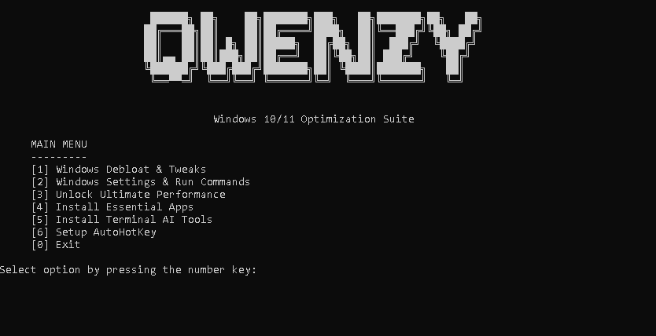

# Windows Automation Toolkit v2.0.1

A comprehensive Windows 10/11 optimization toolkit that automates cleanup, system tweaks, power settings, and configuration tasks.



## Features

- **Windows Debloat & Tweaks** - Remove bloatware, optimize system settings
- **Automated Windows Optimization** - Apply OPTIMIZE.md cleanup, privacy, network, interface, service, and performance settings
- **Power Management** - Unlock Ultimate Performance plan, manage power profiles
- **AutoHotKey Manager** - Manage automation scripts

## Documentation

- [Complete Optimization Guide](docs/OPTIMIZE.md) - Detailed Windows 10/11 optimization instructions

## Installation Options

Choose the method that works best for you:

### Option 1: Download Executable (Fastest, Recommended)
**Best for:** Quick use, no Python installation needed

```powershell
powershell -ExecutionPolicy Bypass "iwr https://raw.githubusercontent.com/Drakaniia/qwenzy/main/scripts/install.ps1 | iex"
```

This will:
- Download the latest `.zip` from Releases
- Extract and launch the toolkit immediately
- No Python required

Or download manually from [Releases](https://github.com/Drakaniia/windows-automation-toolkit/releases)

For all installation paths, see the [Full Installation Guide](docs/INSTALLATION.md).

### Option 2: Manual Installation
**Best for:** Developers, contributors

```bash
git clone https://github.com/Drakaniia/qwenzy.git
cd qwenzy
pip install -r requirements.txt
python main.py
```

Or build your own executable:
```bash
pip install -r requirements.txt
powershell -ExecutionPolicy Bypass ".\scripts\build-exe.ps1"
```

## Requirements

- Windows 10/11
- Administrator privileges (recommended)
- Internet connection (for downloads)
- Windows Package Manager (winget) - for package-managed toolkit actions

## Usage

1. Launch the toolkit (via executable or `python main.py`)
2. Accept admin privileges when prompted
3. Use the Textual tabs and action tables to access different modules
4. All operations require confirmation before execution

### Textual TUI

The default Python entry point now opens a modern Textual interface:

```bash
python main.py
```

Use the search field to filter actions, arrow keys to move through tables, `r` to run the selected action, `Ctrl+R` to refresh status, and `q` to quit. Actions that install software, run remote PowerShell scripts, or change system configuration ask for confirmation first.

The TUI code lives in `src/tui/app.py`, the UI-neutral action catalog and command execution live in `src/tui/services.py`, and styling is isolated in `src/tui/toolkit.tcss`.

## Troubleshooting

- **Winget not found**: Install Windows Package Manager from Microsoft Store
- **PowerShell scripts blocked**: Run as administrator

## License

Educational and personal use. Use at your own risk.
