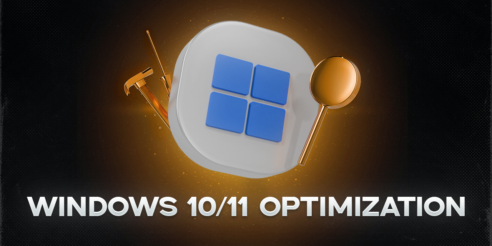

# Complete Guide to Windows 10 and Windows 11 Optimization

This comprehensive guide is designed for fine-tuning and optimizing Windows 10 and Windows 11 to improve performance, system responsiveness, and disable unnecessary features. All steps are divided into logical blocks and provided with detailed explanations.

> **⚠️ Attention!**
> Before starting, it is recommended to create a system restore point.
> Perform actions carefully, following the instructions. The author is not responsible for possible failures.



---

## 📋 Table of Contents

### Windows 10
1. [Disk Cleanup (Windows 10)](#disk-cleanup-windows-10)
2. [Power and Network Optimization (Windows 10)](#power-and-network-optimization-windows-10)
3. [System Settings Configuration (Windows 10)](#system-settings-configuration-windows-10)
4. [Privacy and Security (Windows 10)](#privacy-and-security-windows-10)
5. [Program and Startup Management (Windows 10)](#program-and-startup-management-windows-10)
6. [Peripheral Configuration (Windows 10)](#peripheral-configuration-windows-10)
7. [Disabling Unnecessary Services (Windows 10)](#disabling-unnecessary-services-windows-10)
8. [Additional Settings (Windows 10)](#additional-settings-windows-10)

### Windows 11
9. [System Preparation (Windows 11)](#system-preparation-windows-11)
10. [Disk Cleanup (Windows 11)](#disk-cleanup-windows-11)
11. [Power and Network Optimization (Windows 11)](#power-and-network-optimization-windows-11)
12. [System Settings Configuration (Windows 11)](#system-settings-configuration-windows-11)
13. [Personalization and Interface (Windows 11)](#personalization-and-interface-windows-11)
14. [Privacy and Protection (Windows 11)](#privacy-and-protection-windows-11)
15. [Program Management (Windows 11)](#program-management-windows-11)
16. [Disabling Unnecessary Services (Windows 11)](#disabling-unnecessary-services-windows-11)
17. [Additional Settings (Windows 11)](#additional-settings-windows-11)

---

## Windows 10

### Disk Cleanup (Windows 10)

#### 1. Deleting Temporary Files
Press `Win + R` and enter the following commands one by one. In the opened windows, delete ALL contents of these folders (select all with `Ctrl+A` and delete with `Delete`).

* `%temp%`
* `temp`
* `prefetch`

> **Note:** The system may prevent deletion of some files — this is normal, just skip them.

#### 2. Cleaning Windows Update Cache
Press `Win + R`, enter:
* `%windir%\SoftwareDistribution\Download`
Delete all contents of this folder.

#### 3. Cleaning NVIDIA Driver Cache (if you have an NVIDIA graphics card)
Press `Win + R` and enter the following paths one by one:
* `%ProgramData%\NVIDIA Corporation\Downloader`
* `%ProgramFiles%\NVIDIA Corporation\Installer2`
Delete the contents of these folders.

#### 4. Uninstalling OneDrive (Optional)
If you do not use OneDrive, it can be completely uninstalled.

1. Open the command prompt (Run as administrator: press `Win+X` and select "Command Prompt (Admin)" or "Windows PowerShell (Admin)").
2. Copy and execute the commands one by one:
    ```cmd
    taskkill /f /im OneDrive.exe
    %SystemRoot%\SysWOW64\OneDriveSetup.exe /uninstall
    ```

### Power and Network Optimization (Windows 10)

#### 1. Network Adapter Configuration
1. Press `Win + R`, enter `devmgmt.msc`, and press Enter (Device Manager will open).
2. Expand "Network adapters", right-click on your network adapter, and select "Properties".
3. Go to the "Advanced" tab. Find and set the following items to **Disabled** (not all may be present):
    * `Energy Efficient Ethernet (EEE)`
    * `Advanced EEE`
    * `Gigabit Lite`
    * `Green Ethernet`
    * `Power Saving Mode`
    * `Selective Suspend`
4. Go to the "Power Management" tab and **uncheck all boxes**.

#### 2. TCP/IP Network Stack Optimization
1. Launch the command prompt **as administrator**.
2. Execute the following commands one by one:
    ```cmd
    netsh int tcp set global autotuninglevel=disabled
    netsh int tcp set supplemental template=internet congestionprovider=ctcp
    ```
    These commands disable automatic TCP tuning and set a more aggressive algorithm for better download speed.

#### 3. Increasing Network Throughput
1. Press `Win + R`, enter `gpedit.msc`, and press Enter (Local Group Policy Editor will open).
2. Navigate to: `Computer Configuration -> Administrative Templates -> Network -> QoS Packet Scheduler`.
3. Find the policy "Limit reservable bandwidth", double-click it, set it to "Enabled", and in the "Bandwidth limit" field, specify **0**.

### System Settings Configuration (Windows 10)

Most settings are located in the "Windows Settings" app (`Win + I`).

#### System
* **Notifications & actions:** "Edit quick actions" — disable everything unnecessary.
* **Focus assist:** Disable all automatic rules and uncheck "Show summary on timeline...".
* **Display:**
    * Set "Scale and layout" to **100%**.
    * "Graphics" -> "Change graphics settings" -> Enable "**Hardware-accelerated GPU scheduling**" (if you are not a streamer).
    * "Advanced display settings" -> Select the maximum available refresh rate (Hz).
* **Storage:** Disable "**Storage Sense**".
* **Tablet:** Set "When I sign in" to "**Use desktop mode**". Uncheck "Ask me to switch...". In "Additional settings", disable all toggles.
* **Multitasking:** In the "Timeline" section, disable "**Show suggestions on timeline**".

#### Ease of Access
* **Mouse pointer:** Disable "**Show pointer trails**".
* **Magnifier:** Disable and uncheck all boxes.
* **Narrator:** Disable and uncheck all boxes.
* **Keyboard:** Disable "Sticky Keys", "Filter Keys", and all related notifications.

#### Gaming
* **Game Bar:** Disable "**Record game clips and screenshots using Game Bar**".
* **Game Mode:** Enable "**Game Mode**".

#### Update & Security
* **Delivery Optimization:** "Advanced options" -> Disable "**Allow downloads from other PCs**".

### Privacy and Security (Windows 10)

Go to `Settings -> Privacy`.

* **General:** Disable **all** items.
* **Speech, inking, & typing:** Disable voice features and handwriting personalization.
* **Diagnostics & feedback:**
    * Select "**Basic**" telemetry mode.
    * Disable "**Tailored experiences**" and "**Send my device data...**".
* **Activity history:** Disable "**Store my activity history on this device**".
* **Location:**
    * Disable location service.
    * Click "**Clear**" in the "Location history" section.
* **Background apps:** Scroll through the list and **disable** background work for all unnecessary apps.
* **App permissions:** Everything below "Background apps" (e.g., Camera, Microphone, Notifications) is recommended to **review and disable** for apps that do not need the corresponding permission.

### Program and Startup Management (Windows 10)

#### 1. Startup Management
Press `Ctrl + Shift + Esc` -> Go to the "Startup" tab. Right-click on unnecessary programs and select "Disable".

#### 2. Uninstalling Programs
Press `Win + R`, enter `appwiz.cpl` -> Uninstall programs you do not use.

#### 3. Disabling Background Apps
`Settings -> Apps -> Background apps` -> Set the "Let apps run in the background" toggle to **Off** or selectively disable unnecessary apps.

### Peripheral Configuration (Windows 10)

#### Mouse
1. `Settings -> Devices -> Mouse -> Additional mouse options`.
2. In the "Pointer Options" tab — **uncheck** "**Enhance pointer precision**".
3. In the "Buttons" tab — set the "Double-click speed" slider to **maximum**.

#### Keyboard
`Settings -> Ease of Access -> Keyboard` -> Disable all options: "Sticky Keys", "Filter Keys", "Toggle Keys".

### Disabling Unnecessary Services (Windows 10)

1. Press `Win + R`, enter `services.msc`.
2. For each service from the list below, find it, double-click, set "Startup type: **Disabled**", click "Stop", and "Apply".

**List of services to disable (with explanations):**

* **Hyper-V Services (if you do not use virtual machines):**
    * HV Host Service
    * Hyper-V PowerShell Direct Service
    * Hyper-V Heartbeat Service
    * Hyper-V Virtual Machine Management
    * Hyper-V Time Synchronization Service
    * Hyper-V Guest Shutdown Service
    * Hyper-V Data Exchange Service
    * Hyper-V Virtual Machine Session Service

* **Sensor Services (if you do not have fingerprint or light sensors):**
    * Sensor Service
    * Sensor Data Service
    * Sensor Monitoring Service

* **Other Services:**
    * Windows Biometric Service
    * Xbox Live Networking Service
    * Connected User Experiences and Telemetry
    * Windows Mixed Reality OpenXR Service (if you do not have a VR headset)
    * Xbox Accessory Management Service (if you do not have Xbox accessories)
    * WalletService and NFC (if you do not use NFC)
    * NetBIOS over TCP/IP Support (for home networks)
    * Smart Card Removal Policy (if you do not use smart cards)
    * Retail Demo Service
    * Telephony
    * BitLocker Drive Encryption Service (if you do not use BitLocker)
    * ActiveX Installer (AxInstSV)
    * Touch Keyboard and Handwriting Panel Service (if you do not have a touch screen)

### Additional Settings (Windows 10)

#### 1. File Explorer Configuration
1. Open any folder. Click "File" -> "Change folder and search options".
2. In the "General" tab:
    * Set "Open File Explorer to:" to "**This PC**".
    * Uncheck "Show recently used files..." and "Show frequently used folders...".

#### 2. Disabling Remote Access
1. Press `Win + Pause/Break` (opens "System Properties").
2. On the left, select "Advanced system settings".
3. In the "Remote" tab, select "**Do not allow remote connections to this computer**".

#### 3. Ease of Access Settings (Control Panel)
1. Open Control Panel -> Ease of Access Center.
2. Go through each item one by one and uncheck all boxes, especially:
    * **Optimize visual display** (uncheck all).
    * **Make the mouse easier to use** -> "Set up Mouse Keys" (uncheck all boxes).
    * **Make the keyboard easier to use** -> "Set up Sticky Keys", "Set up Filter Keys" (uncheck all boxes).

#### 4. Disabling Indexing (not critical for SSD, but reduces background activity)
1. Open "This PC", right-click on the system drive (C:) -> "Properties".
2. At the bottom, uncheck "**Allow files on this drive to have contents indexed in addition to file properties**". Apply changes to all subfolders and files.

---

## Windows 11

### System Preparation (Windows 11)

> **ℹ️ Note:**
> This section is intended for optimizing Windows 11 after reinstalling the system. It is recommended to perform the settings in order.

#### 1. System Update
* Go to `Settings → Windows Update`
* Click "Check for updates"
* Install all available updates
* **Restart your computer** after installation

### Disk Cleanup (Windows 11)

#### 1. Deleting Temporary Files
Press `Win + R` and enter the following commands one by one. In the opened windows, delete the contents of these folders:

* `%temp%`
* `temp`
* `prefetch`

#### 2. Cleaning Windows Update Cache
Press `Win + R`, enter:
* `%windir%\SoftwareDistribution\Download`
Delete all contents of this folder.

#### 3. Cleaning App Store Cache
1. Press `Win + R`, enter `wsreset.exe`, and press Enter
2. Wait for the process to complete (an empty command prompt window will open and close automatically)

#### 4. Uninstalling OneDrive (Optional)
If you do not use OneDrive, it can be completely uninstalled:

1. Open PowerShell as administrator (`Win + X` → "Windows Terminal (Admin)")
2. Execute the commands one by one:
    ```powershell
    taskkill /f /im OneDrive.exe
    winget uninstall OneDrive
    ```

### Power and Network Optimization (Windows 11)

#### 1. Network Adapter Configuration
1. Press `Win + R`, enter `devmgmt.msc`
2. Expand "Network adapters", right-click on your adapter → "Properties"
3. In the "Advanced" tab, disable:
    * `Energy Efficient Ethernet (EEE)`
    * `Green Ethernet`
    * `Power Saving Mode`
    * `Selective Suspend`
4. In the "Power Management" tab, **uncheck all boxes**

#### 2. TCP/IP Network Stack Optimization
1. Launch Windows Terminal **as administrator**
2. Execute the commands:
    ```powershell
    netsh int tcp set global autotuninglevel=disabled
    netsh int tcp set supplemental template=internet congestionprovider=ctcp
    ```

#### 3. Increasing Network Throughput
1. Press `Win + R`, enter `gpedit.msc`
2. Navigate to: `Computer Configuration → Administrative Templates → Network → QoS Packet Scheduler`
3. Enable the policy "Limit reservable bandwidth" and set the value to **0%**

### System Settings Configuration (Windows 11)

#### 1. System Settings
* **Notifications:**
  * `Settings → System → Notifications`
  * Disable:
    - "Get tips and suggestions when using Windows"
    - "Show suggestions for device setup"
  * Disable unnecessary app notifications

* **Focus assist:**
  * `Settings → System → Focus assist`
  * Disable **all** toggles

* **Storage:**
  * `Settings → System → Storage`
  * Disable "Storage Sense"

* **Remote Desktop:**
  * `Settings → System → Remote Desktop`
  * Disable remote access

* **Clipboard:**
  * `Settings → System → Clipboard`
  * Clear history and disable synchronization

#### 2. Power and Performance
* `Settings → System → Power`
* Click "Additional power settings" (on the right)
* Select "**High performance**"

#### 3. Ease of Access
* **Magnifier:** `Settings → Ease of Access → Magnifier` → Disable everything
* **Narrator:** `Settings → Ease of Access → Narrator` → Disable everything
* **Speech:** `Settings → Ease of Access → Speech` → Disable everything
* **Eye Control:** `Settings → Ease of Access → Eye Control` → Disable everything

#### 4. Gaming Settings
* **Xbox Game Bar:** `Settings → Gaming → Xbox Game Bar` → Disable
* **Captures:** `Settings → Gaming → Captures` → Disable all toggles
* **Game Mode:** `Settings → Gaming → Game Mode` → Enable

### Personalization and Interface (Windows 11)

#### 1. Taskbar
* `Settings → Personalization → Taskbar → Taskbar behaviors`
  * Set "Taskbar alignment" → "**Center**" (recommended)
  * Enable "Automatically hide the taskbar" (optional)

* `Settings → Personalization → Taskbar → Taskbar items`
  * Disable unnecessary items (e.g., "Search", "Task View")

* `Settings → Personalization → Taskbar → Taskbar corner overflow`
  * Configure the display of icons in the system tray

#### 2. Start Menu
* `Settings → Personalization → Start`
  * Disable:
    - "Show recently added apps"
    - "Show most used apps"
    - "Show recently opened items in Start, Jump Lists, and File Explorer"

* `Settings → Personalization → Start → Folders`
  * Select folders to display next to the power button

#### 3. File Explorer
* Open File Explorer → click "..." (three dots) → "Options"
  * Set "Open File Explorer to:" → "**This PC**"
  * In the "Privacy" tab:
    - Uncheck **all** boxes
    - Click "Clear history"
    - Click "Apply"

### Privacy and Protection (Windows 11)

#### 1. Basic Privacy Settings
* `Settings → Privacy & security → General`
  * Disable **all** toggles

* `Settings → Privacy & security → Speech`
  * Disable everything

* `Settings → Privacy & security → Inking & typing personalization`
  * Disable

#### 2. Diagnostics and Logs
* `Settings → Privacy & security → Diagnostics & feedback`
  * Disable everything
  * Click "Delete diagnostic data"

* `Settings → Privacy & security → Activity history`
  * Disable "Store my activity history on this device"
  * Click "Clear activity history"

#### 3. App Permissions
* Scroll through the list in `Settings → Privacy & security`
* For each section (Camera, Microphone, Location, etc.):
  * Disable access for unnecessary apps
  * Disable "Let apps access your..."

### Program Management (Windows 11)

#### 1. Apps and Features
* `Settings → Apps → Apps & features`
  * Set "Choose where to get apps" → "**Anywhere**"
  * Disable "Cross-device experiences"

#### 2. Startup
* `Settings → Apps → Startup`
  * Disable unused apps
  > ⚠️ **Recommendation:** Do not disable unfamiliar system apps

#### 3. Background Apps
* `Settings → Apps → Background apps`
  * Set "Let apps run in the background" → "**Off**"
  * Or selectively disable unnecessary apps

#### 4. Uninstalling Programs
* Press `Win + R`, enter `appwiz.cpl`
* Uninstall programs you do not use

### Disabling Unnecessary Services (Windows 11)

> **ℹ️ Important:**
> For Windows 11, use the same list of services as for Windows 10, but not all services may be present in your version of the system. Disable only those that exist and are not used.

1. Press `Win + R`, enter `services.msc`
2. For each service from the list below, find it, double-click:
   * Set "Startup type: **Disabled**"
   * Click "Stop"
   * Click "Apply"

**Main Services to Disable in Windows 11:**

* **Hyper-V Services** (if you do not use virtualization)
* **Sensor Services** (if you do not have fingerprint/light sensors)
* **Windows Biometric Service** (if you do not use it)
* **Xbox Live Networking Service** (if you do not play Xbox games)
* **Connected User Experiences and Telemetry**
* **Windows Mixed Reality OpenXR Service** (if you do not have a VR headset)
* **Xbox Accessory Management Service** (if you do not have Xbox accessories)
* **WalletService and NFC** (if you do not use NFC)
* **NetBIOS over TCP/IP Support** (for home networks)
* **Smart Card Removal Policy** (if you do not use smart cards)
* **Retail Demo Service**
* **Telephony**
* **BitLocker Drive Encryption Service** (if you do not use BitLocker)
* **Touch Keyboard and Handwriting Panel Service** (if you do not have a touch screen)

### Additional Settings (Windows 11)

#### 1. Windows Update Center
* `Settings → Windows Update → Advanced options`
  * Disable all toggles
  * Go to "Delivery Optimization"
  * Disable "**Downloads from other PCs**"

#### 2. Disabling Indexing (for SSD)
1. Open "This PC"
2. Right-click on the system drive (C:) → "Properties"
3. Uncheck "**Allow files on this drive to have contents indexed...**"
4. Apply changes to all subfolders

#### 3. Mouse Configuration
1. `Settings → Bluetooth & devices → Mouse`
2. Click "Additional mouse settings"
3. In the "Pointer Options" tab:
   * Uncheck "**Enhance pointer precision**"
4. In the "Buttons" tab:
   * Set double-click speed to **maximum**

#### 4. Keyboard Configuration
* `Settings → Ease of Access → Keyboard`
* Disable all options:
  * "Sticky Keys"
  * "Filter Keys"
  * "Toggle Keys"

---

## Conclusion

After completing these steps, it is recommended to restart your computer. You should notice improved system responsiveness, freed-up disk space, and more efficient resource usage.

---
**Found a bug or have a suggestion?** Create an Issue or Pull Request on GitHub!
